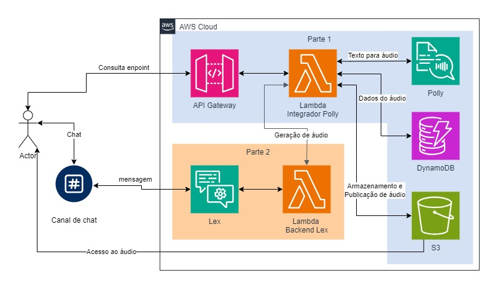

# 🍕🤖 Pizza D'Italy Bot

O projeto Pizza D'Italy Bot foi desenvolvido como parte das sprints 6 e 7 do programa de bolsas Compass UOL para formação em machine learning na AWS. Ele consiste em um chatbot de uma pizzaria que foi criado utilizando Amazon Lex.

## 📖 Índice

- [📝 Descrição do Projeto](#-pizza-ditaly-bot)
- [🏛️ Arquitetura](#️-arquitetura)
- [⚙️ Tecnologias Utilizadas](#️-tecnologias-utilizadas)
- [🔎 Sobre o Chatbot](#-sobre-o-chatbot)
- [🚀 Execução e Utilização](#-execução-e-utilização)
  - [Pré-requisitos](#pré-requisitos)
  - [Passos de inicialização](#passos-de-inicialização)
  - [Passos para executar as funções com o Serverless no API Gateway e Lambda](#passos-para-executar-as-funções-com-o-serverless-no-api-gateway-e-lambda)
  - [Passos para executar o chatbot no Lex e o backend no Lambda](#passos-para-executar-o-chatbot-no-lex-e-o-backend-no-lambda)
- [🧱 Estrutura do Projeto](#-estrutura-do-projeto)
- [🚧 Desafios e Soluções](#-desafios-e-soluções)
- [💬 Acesso ao chatbot](#-acesso-ao-chatbot)
- [👥 Contribuidores](#-contribuidores)

## 🏛️ Arquitetura

O chatbot segue a arquitetura do diagrama simples abaixo onde o actor usa o canal de conversãção para se comunicar com os serviços de Cloud da AWS:



## ⚙️ Tecnologias Utilizadas

- **[Lex](https://aws.amazon.com/lex/)** - *Interface do canal de conversação*
- **[Polly](https://aws.amazon.com/polly/)** - *Conversor de textos para áudio*
- **[DynamoDB](https://aws.amazon.com/dynamodb/)** - *Armazenamento de dados de texto em objetos*
- **[S3](https://aws.amazon.com/s3)** - *Armazenamento de arquivos de áudio em Buckets*
- **[API Gateway](https://aws.amazon.com/api-gateway)** - *Expositor das funções Lambda em forma de endpoint API*
- **[Lambda](https://aws.amazon.com/lambda)** - *Controlador do backend do Lex e integrador do Polly com S3 e DynamoDB*
- **[NodeJS](https://nodejs.org/)/[Express](https://expressjs.com)** - *Manipulação do servidor backend em desenvolvimento*
- **[Serverless](https://www.serverless.com/)** - *Criação de aplicações serverless na AWS*
- **[Python](https://www.python.org/)** - *Criação das funções Lambda da API de conversão de texto para áudio*
- **[Boto3](https://www.python.org/)** - *Integração do python com os serviços AWS*
- **[Ngrok](https://nodejs.org/)/[Express](https://expressjs.com)** - *Exposição do servidor backend de desenvolvimento para ser integrado na função Lambda do Chatbot*
- **[Axios](https://axios-http.com)** - *Requisição para o endpoint de conversão de texto para áudio*
- **[Git](https://git-scm.com)/[GitHub](https://github.com)** - *Controle de versão do código*
- **[Trello](https://trello.com)** - *Gerenciamento e organização das tarefas do projeto*

## 🔎 Sobre o Chatbot

Este projeto é um chatbot desenvolvido para auxiliar os clientes de uma pizzaria a realizarem pedidos, verificar o cardápio, obter detalhes sobre os sabores disponíveis, e mais. O chatbot foi implementado usando o Amazon Lex e possui cinco intents principais para lidar com as interações dos usuários.

## 🤖 Intents do Chatbot

### 1. **WelcomeIntent**
   - **Descrição:** A `WelcomeIntent` é a intent responsável por cumprimentar o usuário e iniciar a interação. Quando o usuário inicia uma conversa com o chatbot, essa intent é ativada para oferecer uma mensagem de boas-vindas e orientar o usuário sobre o que o bot pode fazer.
   - **Exemplos de frases:**
     - "Olá"
     - "Oi"
     - "Bom dia"
     - "Boa tarde"

### 2. **GetMenuIntent**
   - **Descrição:** A `GetMenuIntent` permite que o usuário visualize o cardápio completo da pizzaria. Ao solicitar o menu, o bot responde com uma lista de todas as pizzas disponíveis, juntamente com seus preços e tamanhos.
   - **Exemplos de frases:**
     - "Quero ver o cardápio"
     - "Me mostre o menu"
     - "O que vocês têm no cardápio?"
     - "Quais pizzas vocês têm?"

### 3. **GetDetailsOfPizzaIntent**
   - **Descrição:** A `GetDetailsOfPizzaIntent` é ativada quando o usuário deseja obter informações detalhadas sobre um sabor específico de pizza. 
   - **Exemplos de frases:**
     - "Quais os ingredientes da pizza Marguerita?"
     - "Me fale mais sobre a pizza Calabresa"

### 4. **OrderPizzaIntent**
   - **Descrição:** A `OrderPizzaIntent` permite que o usuário faça um pedido de pizza. O bot irá perguntar o sabor, o tamanho e o endereço de entrega. Se o sabor ou tamanho não for especificado inicialmente, o bot irá solicitar essas informações ao usuário.
   - **Exemplos de frases:**
     - "Eu gostaria de uma pizza"
     - "Gostaria de pedir uma pizza"
     - "Quero uma pizza de Calabresa grande"
     - "Quero fazer um pedido"

### 5. **FallbackIntent**
   - **Descrição:** A `FallbackIntent` é a intent padrão que é ativada quando o chatbot não consegue entender a solicitação do usuário ou quando nenhuma das outras intents é adequada para a entrada dada. Esta intent fornece uma mensagem de erro amigável e sugere ao usuário tentar novamente ou reformular sua pergunta.

## 🚀 Execução e Utilização

### Pré-requisitos

- **Git**
- **Python >=3.11**
- **NodeJS >=20**
- **Conta na AWS**
- **AWS CLI V2**
- **Conta no Slack**

---

### Passos de inicialização

1. Baixe e instale a AWS CLI V2. Mais informações [aqui](https://docs.aws.amazon.com/cli/latest/userguide/getting-started-install.html).

2. Configure a AWS CLI da forma que preferir. Mais informações [aqui](https://docs.aws.amazon.com/cli/latest/userguide/cli-configure-files.html).

3. Clone e abra o projeto no VScode ou editor de preferência:

```bash
git clone -b grupo-2 --single-branch https://github.com/Compass-pb-aws-2024-MAIO-A/sprints-6-7-pb-aws-maio.git
cd sprints-6-7-pb-aws-maio
code .
```

### Passos para executar as funções com o Serverless no API Gateway e Lambda

1. Instale o framework serverless em seu computador. Mais informações [aqui](https://www.serverless.com/framework/docs/getting-started).

```bash
npm install -g serverless
```

2. Crie um ambiente virtual python usando o venv. Mais informações [aqui](https://docs.python.org/3/library/venv.html).

3. Na raiz do projeto com o ambiente virtual configurado, instale as dependências de api/ com:

```bash
pip install -r api/requeriments.txt
```

4. Navegue até a pasta /api e crie um arquivo `.env` seguindo o modelo do arquivo [.env.example](/api/.env.example)

5. Na pasta api/, instale as depedências node com:

```bash
npm install
```

6. Execute o comando do serverless dentro da pasta api/ e utilize a opção de login para ser logado em uma conta.

```bash
serverless # caso esteja com problema de permissão do usuário, use "npx serverless"
```

7. Após estar logado no serverless e na AWS CLI, execute o deploy da aplicação serverless:

```bash
serverless deploy
```

- Depois de efetuar o deploy, vocẽ terá um retorno parecido com isso no terminal:

```bash
DOTENV: Loading environment variables from .env:

         - S3_BUCKET_NAME

         - DYNAMODB_TABLE

         - PROFILE_NAME

Deploying "api-tts" to stage "dev" (us-east-1)

✔ Service deployed to stack api-tts-dev (111s)

endpoints:
  GET - https://xxxxxxxxxx.execute-api.us-east-1.amazonaws.com/
  GET - https://xxxxxxxxxx.execute-api.us-east-1.amazonaws.com/v1
  POST - https://xxxxxxxxxx.execute-api.us-east-1.amazonaws.com/v1/tts
functions:
  health: api-tts-dev-health (55 MB)
  v1Description: api-tts-dev-v1Description (55 MB)
  v1_tts: api-tts-dev-v1_tts (55 MB)
```

6. Abra um testador de api, como o `Postman`, e teste os endpoints abaixo que podem ter as seguintes retornos:

#### Rota 1 → Get /

```json
  {
    "message": "Go Serverless v4.1! Your function executed successfully!",
    "input": { 
        ...(event)
      }
  }
```

- Status code para sucesso da requisição será `200`

#### Rota 2 → Get /v1

```json
  {
    "message": "TTS api version 1."
  }
```

- Status code para sucesso da requisição será `200`

#### Rota 3 → Post /v1/tts

- Deverá receber um post `json` com o seguinte formato

```json
  {
    "phrase": "converta esse texto para áudio e salve uma referencia no dynamoDB. Caso a referencia já exista me devolva a URL com audio já gerado"
  }
```

- Resposta a ser entregue é tem um status `201` com um `json` assim:

```json
  {
    "received_phrase": "converta esse texto para áudio...",
    "url_to_audio": "https://meu-buckect/audio-xyz.mp3",
    "created_audio": "02-02-2023 17:00:00",
    "unique_id": "123456"
  }
```

---

### Passos para executar o chatbot no Lex e o backend no Lambda

1. Abra o console aws na página do Amazon Lex vá na opção de importar um chatbot, selecione o arquivo `zip` que está na pasta bot/ e crie um bot com o nome e preferências que quiser, após importado faça o build do chatbot.

2. Crie uma pasta com nome de preferência no seu ambiente local, inicie um projeto node, instale o axios e depois faça um zip dos arquivos da pasta, use os comandos:

```bash
npm init -y
npm install axios
zip node_modules,package.json,package-lock.json axios.zip
```

3. Volte para o console, vá em Amazon Lambda e em Layers, crie uma layer com este zip gerado, com nome de sua preferência.

4. Ainda no Amazon Lambda, agora crie uma função de lambda com tudo que estiver na pasta server/lambda/ e utilize a layer criada acima.

5. Configure a variável de ambiente que está localizada em [.env.example](server/.env.example) na sua função de lambda, essa varíavel é o endpoint do serverless gerado com os passos acima.

6. Volte no seu bot do Amazon Lex e configure esta função de lambda em **deployment > aliases > alias_name > alias language support > lambda function**.

7. Faça testes no chat ou se preferir pule esta etapa e já configure o chatbot no Slack. Mais informações [aqui](https://docs.aws.amazon.com/pt_br/lex/latest/dg/slack-bot-assoc-create-assoc.html).

## 🧱 Estrutura do Projeto

...

## 🚧 Desafios e Soluções

### 1. Confiança Elevada em Intents Inesperadas
- **Desafio:** O bot estava acionando intents como `WelcomeIntent` com uma confiança alta, mesmo para entradas irrelevantes, como um simples "s". Isso causava comportamentos indesejados no bot, que respondia inadequadamente a entradas que deveriam ter acionado o fallback.
- **Solução:** Foram revisadas as utterances (frases de treinamento) das intents, adicionando novas frases e refinando as existentes para melhorar a precisão do NLU. Além disso, foram implementados filtros no código para garantir que apenas intents com confiança superior a 0.85 fossem acionadas.

### 2. Fallback Ineficiente
- **Desafio:** O fallback do bot não estava funcionando conforme o esperado, resultando em respostas inadequadas quando o bot não conseguia entender a entrada do usuário.
- **Solução:** Foi revisado e corrigido o código do fallback para garantir que qualquer entrada não compreendida pelo bot acionasse corretamente a intent de fallback. Além disso, melhorias foram feitas nas mensagens de fallback para fornecer uma melhor experiência ao usuário.

### 3. Configuração e Estruturação do Projeto
- **Desafio:** Durante o desenvolvimento, surgiu a necessidade de uma estrutura de projeto clara e organizada, especialmente ao lidar com múltiplas intents e funções de manipulação em Lambda.
- **Solução:** A estrutura do projeto foi organizada em pastas específicas para os controladores (`controllers`) e utilitários (`utils`), separando as responsabilidades e facilitando a manutenção do código. Além disso, scripts para gerenciamento das branches e commits foram estabelecidos para manter um fluxo de trabalho limpo e eficiente.

## 💬 Acesso ao Chatbot

...

## 👥 Contribuidores

- **[Arthur Lyra](https://github.com/arthur-lyra)**
- **[Emanuelle Garcia](https://github.com/emanuelleGued)**
- **[Ester Trevisan](https://github.com/estertrvs)**
- **[Richard Freitas](https://github.com/wesleyfreit)**
